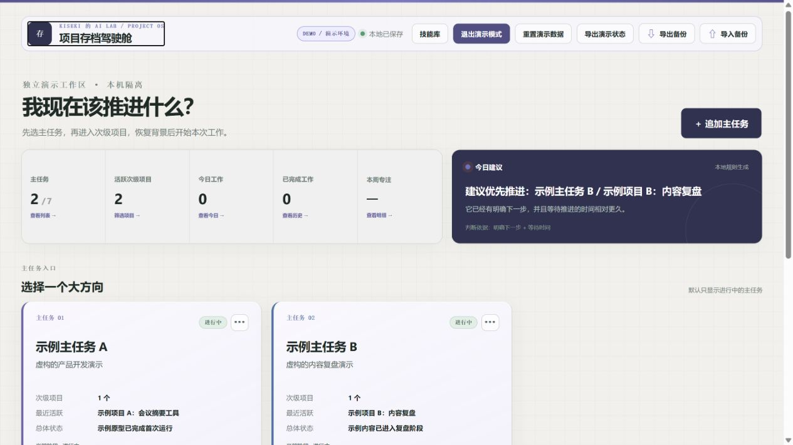

# 项目存档驾驶舱 / Project OS

**项目太多，脑子记不住做到哪？**

这是一个 Local First 的个人项目存档驾驶舱。它把主任务、次级项目、真实工作证据和项目记忆隔离保存，让你下次回来时能直接恢复“上次做到哪”。

> **当前版本仅支持 Windows 10 / Windows 11。**
>
> **macOS / Linux 暂未适配，也未完成测试。**

它现在可以帮助你：

- 每天先看清“昨天做了什么、今天该做什么、项目卡在哪里”
- 保存主任务 / 次级项目状态与明确的只读关联边界
- 启动后按 `lastSyncAt` 自动检查 Git 与已注册项目目录
- 通过稳定来源标识追踪移动或重命名后的 Git 仓库与历史路径
- 将 commit、明确工作单元、文件和测试报告整理为带 Evidence 的 Activity Event
- 在轻量 Review 中确认归属，再投影更新项目状态
- 记录、暂停、恢复和纠正每次工作 Session
- 保存长期项目记忆并恢复上次进度
- 生成可交给 ChatGPT / Codex / DeepSeek 的上下文 Prompt
- 解析 AI 返回的 JSON，由用户确认后更新项目状态
- 导入、导出本地 JSON 备份

核心原则：

> **Do the work, not the reporting.**
>
> 用户负责工作，Project OS 根据真实 Evidence 观察工作；规则优先，低置信度才打扰用户。

出品：**kiseki 的 AI Lab**



## 系统要求

当前支持：

- ✅ Windows 11
- ✅ Windows 10
- ✅ Node.js 20 LTS 或更高版本

暂不支持：

- ❌ macOS
- ❌ Linux

当前启动脚本与本地运行流程以 Windows 为目标设计。macOS / Linux 尚未适配和验证，请不要将当前版本视为跨平台应用。

## 安装与启动

1. 在 Windows 10 / 11 安装 [Node.js 20 LTS 或更高版本](https://nodejs.org/)。
2. Clone 本仓库，或从 GitHub 下载 ZIP 并完整解压。
3. 双击根目录中的 `启动项目存档驾驶舱.cmd`。
4. 等待浏览器打开 `http://127.0.0.1:4173`。Dashboard 会立即可用，Auto Sync 在后台检查上次 checkpoint 以来的增量。

项目没有第三方运行依赖，因此无需安装额外 npm 包。也可以在项目根目录运行：

```powershell
npm start
```

然后手动打开 `http://127.0.0.1:4173`。关闭本地服务窗口即可停止运行。

## 第一次使用

1. 建立一个长期方向（主任务），例如“产品开发”。
2. 在主任务下建立当前要推进的次级项目。
3. 在项目的“工作目录”中每行填写一个本地目录。路径只做精确去重，不会把父子目录误认为同一条。
4. 点击 **同步最近工作**，在 Review 中确认、改归属或忽略活动。文件变化本身不会被判定为任务完成。
5. 在项目中写清当前目标、下一步和明确阻塞，然后开始一次 Session。
6. 结束 Session 时核对开始/结束时间；只有人工确认的时间才计入本周专注。
7. 第二天打开首页，直接查看昨天事实、今天行动和当前卡点。

## Auto Sync 核心工作流

首次为次级项目配置本地项目目录：项目右上角 `···` → **编辑任务** → **Auto Sync 数据源**。首次配置默认只回看最近 24 小时；之后 Git 与 Filesystem 各自维护 checkpoint。

```text
正常使用 Codex / Git / 本地项目目录 / 测试工具
↓
启动 Project OS，Dashboard 立即可用
↓
Sync Run 按 checkpoint 增量采集
↓
ActivityEvent + 多条 Evidence
↓
稳定来源身份 + 明确工作单元 + Project Router
↓
Review Before Merge（高置信度预选，低置信度确认）
↓
Confirmed Event Log
↓
Project State Projection
```

文件修改只会成为可读 Evidence，不会直接被解释为“任务完成”。明确完成或修复说明与通过的测试证据相关联后，才可能建议写入 Completed。人工修正、AI 确认和 Session 结束也写入同一 Event Log，因此撤销自动事件或删除工作记录时可以确定性重放，而不是恢复一份旧快照。

## 手动补充工作流（fallback）

```text
选择主任务
↓
进入次级项目
↓
恢复项目状态
↓
开始本次工作
↓
我卡住了 / 现状总结
↓
Auto Sync 没捕获到历史记录时，生成 Prompt
↓
交给 AI
↓
粘贴 JSON 返回结果
↓
人工确认更新
↓
结束 Session
↓
下次继续
```

## 已实现

- 主任务 / 次级项目两级结构与生命周期管理
- 首页“昨天 / 今天 / 卡点”驾驶舱、规则建议、最近动态及可点击统计明细
- Project Resume：目标、状态、阶段、成果、问题、阻塞与下一步
- 核心状态人工编辑；AI 建议可逐字段勾选、修改后再写入
- Session 计划、最多三项“今日只做”、草稿恢复、暂停、人工时间确认与结束归档
- 工作历史单条删除、批量管理及最后一条历史的项目保留选择
- 长期项目记忆、关键决策、约束、资产、待办池与暂存区
- “我卡住了”Prompt、现状总结 Prompt、Bootstrap Prompt
- AI JSON 解析、预览、人工确认与项目回写
- 旧 Demo Workspace 数据兼容读取；Demo、Skills 与灵感库已退出日常主路径
- 主任务只读关联：必须填写原因、选择共享白名单，不跨项目写回状态
- IndexedDB 自动保存、JSON 导入与导出
- `LocalStorageAdapter`/`IndexedDBAdapter` 与禁用的云端适配器占位
- Auto Sync 后台启动、全局与分 Collector checkpoint
- Git Collector、Filesystem Collector、测试报告识别和失败隔离
- ActivityEvent、Evidence、SyncRun、RoutingRule、稳定 SourceBinding 与只读 ZoneLink 数据边界
- 跨来源活动关联、重复检测、Review Before Merge 与证据链
- Confirmed Event Log 驱动 Project State Projection，包括 `manual_patch` 与 `work_log`
- 事件撤销与从 baseline 重新计算
- Codex Activity Adapter 的正式占位（当前环境无可靠接口时显示 unavailable）

## 数据保存在哪里

正式数据和 Demo 数据默认保存在当前浏览器配置文件的 **IndexedDB** 中：

- 数据库：`project-archive-cockpit`（IndexedDB schema v3）
- 正式工作区：`workspace:normal`
- 演示工作区：`workspace:demo`
- `localStorage` 保存界面偏好、旧版迁移入口和按 workspace/session 隔离的 Session 草稿恢复镜像

创建或编辑主任务、项目、Session、记忆、Skills、Context Link，确认 AI 导入结果，以及执行 Auto Sync Review 时，应用都会自动保存。Git 和目录采集只通过 `127.0.0.1` 本机服务执行，数据不会自动上传到网络，也不会因为 Git 提交而进入仓库。

右上角两个备份按钮分别是：

- **⇩ 导出备份**：将当前正式工作区导出为 JSON；可选附带独立 Demo Workspace。
- **⇧ 导入备份**：读取之前导出的 JSON，预览后覆盖对应的本地工作区。

导出的 JSON 是普通文件，可能包含你的项目内容。请自行保管，不要提交到公开仓库。`.gitignore` 已默认排除常见备份和本地数据库文件。

## 截图

- [首页驾驶舱](docs/screenshots/dashboard.jpg)
- [主任务页](docs/screenshots/zone.jpg)
- [次级项目 Resume](docs/screenshots/project-resume.jpg)
- [本次工作 Session](docs/screenshots/session.jpg)
- [“我卡住了”](docs/screenshots/stuck.jpg)
- [现状总结](docs/screenshots/status-review.jpg)
旧截图仅用于历史版本说明；当前日常入口以实际运行界面为准。

## 开发与验证

```powershell
npm install
npm run check
npm run test:e2e
npm run check:public
```

`npm install` 当前不会下载运行依赖，仅用于生成/校验本地包管理元数据。`check:public` 会扫描常见本地路径、真实项目名、数据库文件和疑似密钥，但它不能替代发布前人工复核。

## 项目结构

当前产品是零依赖静态 Web 应用。为保留已经验证的启动方式，运行文件继续位于仓库根目录，没有为了目录外观强行迁移到 `src/` 或 `public/`。

```text
TaskCockpit/
├─ README.md
├─ LICENSE
├─ CHANGELOG.md
├─ PROJECT_STATUS.md
├─ package.json
├─ index.html
├─ app.js
├─ storage.js
├─ auto-sync.js
├─ lifecycle.js
├─ planning.js
├─ bootstrap.js
├─ ai-workflow.js
├─ styles.css
├─ scripts/
├─ tests/
├─ demo/
├─ docs/
│  ├─ architecture.md
│  └─ screenshots/
└─ 启动项目存档驾驶舱.cmd
```

更多实现说明见 [`docs/architecture.md`](docs/architecture.md)。

## Roadmap（未实现）

以下内容均未实现，也不属于 v0.3.0 的支持范围：

- macOS / Linux 支持
- 云同步与多设备
- 可靠的 Codex session / execution log adapter
- 可视化 RoutingRule / ProjectRelationshipRule 管理页
- 关联项目的语义派生事件（不会简单复制主事件）
- 后台定时采集与系统开机同步
- Skills 自动发现
- 更完整的 Context Link
- 更智能的状态总结

## License

[MIT License](LICENSE)。允许使用、修改、Fork 和学习；转载或分发时请保留许可证与作者署名。
